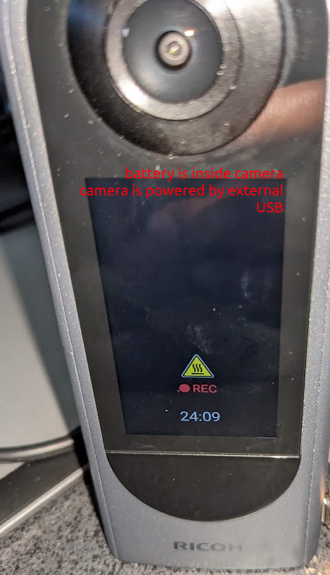
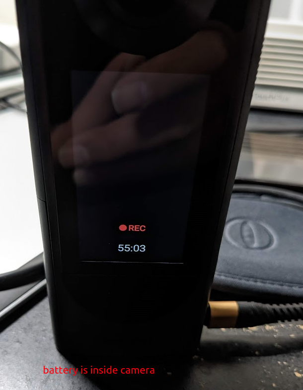
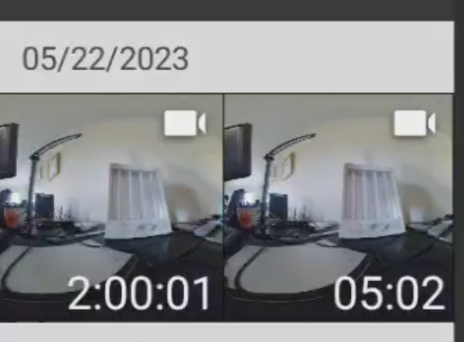
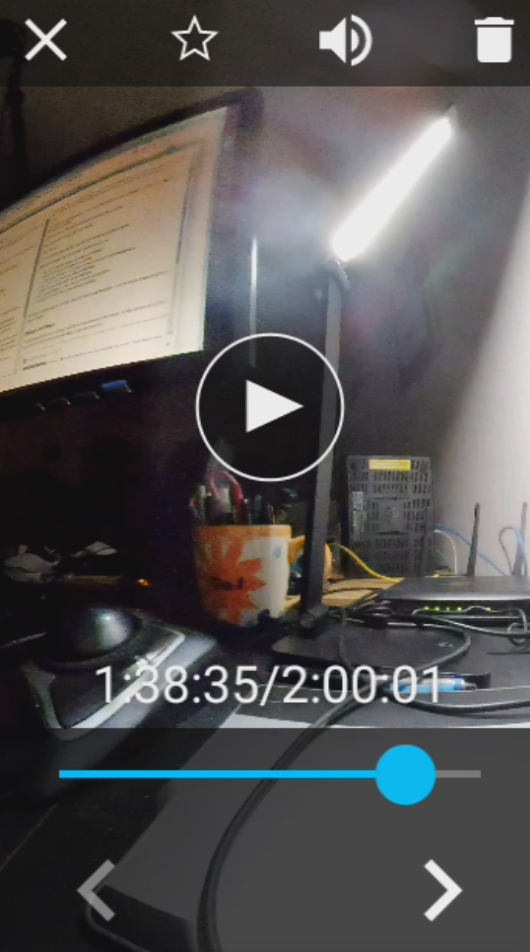

# low FPS video

THETA X supports the following low FPS video formats with a max video of 2 hours:

* 8K 2fps, 5fps, 10fps
* 5.7K 2fps 5fps, 10fps

## 5.7K video format

2fps, economy bitrate, 5min 2sec

```text
File Name                       : R0100250.MP4
File Size                       : 206 MiB
File Modification Date/Time     : 2023:05:22 19:26:32-07:00
File Type                       : MP4
File Type Extension             : mp4
MIME Type                       : video/mp4
Duration                        : 0:05:02
Audio Format                    : mp4a
Audio Channels                  : 1
Audio Bits Per Sample           : 16
Audio Sample Rate               : 48000
Image Width                     : 5760
Image Height                    : 2880
Video Frame Rate                : 1.522
Spherical                       : true
Stitched                        : true
Stitching Software              : RICOH THETA X Ver 2.00.0
Projection Type                 : equirectangular
Source Count                    : 1
Time Stamp                      : 2023:05:23 02:11:41
Make                            : RICOH
Camera Model Name               : RICOH THETA X
Orientation                     : Horizontal (normal)
Resolution Unit                 : inches
Software                        : RICOH THETA X Ver 2.00.0
Modify Date                     : 2023:05:22 19:11:41
Y Cb Cr Positioning             : Centered
Megapixels                      : 16.6
Avg Bitrate                     : 5.57 Mbps
Rotation                        : 0
Focal Length                    : 1.4 mm
```

## Heat

I saw a heat warning sign after 20 minutes.



This did not affect the recording.

The warning sign went away.  I tested the camera at night and the air
temperature got cooler.



## 2 hour test

4.3GB in size.



Video plays with no problem.  Navigation works.


